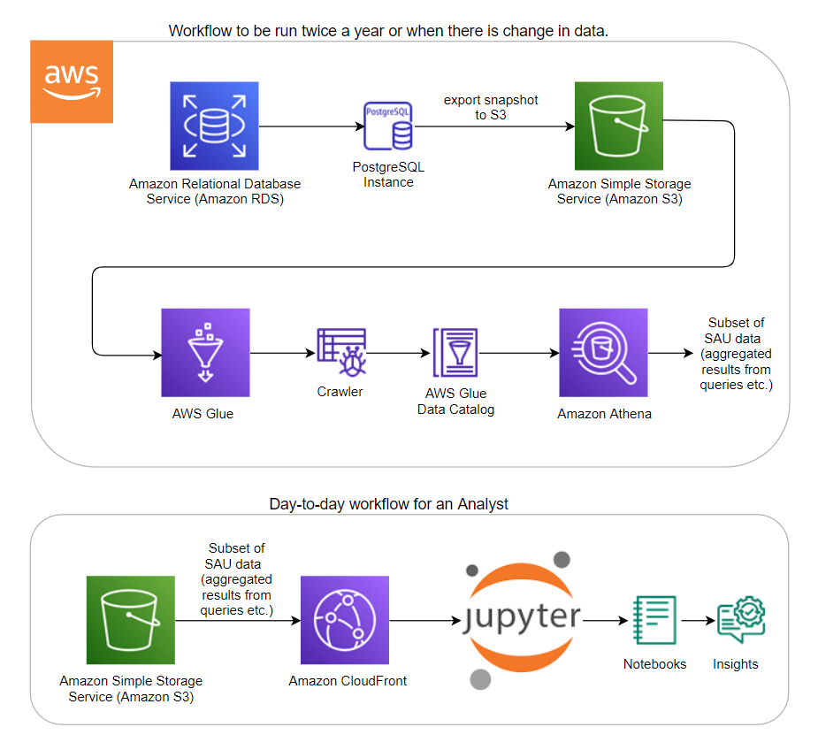

# Sea Around Us

## Project Overview

The [Sea Around Us](http://www.seaaroundus.org/) is an international research initiative at the University of British Columbia, which acts as a critical resource to assess the impact of fisheries on marine environments. The Sea Around Us seeks to improve data access to enhance the meaningful analysis and research through the website and broaden the impact of this important dataset.

To improve the access and enhance the research done using the Sea Around Us website, UBC Cloud Innovation Center is able to provide a solution that offers a new way to interact with and derive insights from the SAU dataset by leveraging AWS services and Jupyter notebooks in a server-less fashion. The proposed solution involves AWS services such as Amazon Relational Database Service (RDS), AWS Glue, Amazon Athena, Amazon Simple Storage Service (S3), and Amazon CloudFront to generate and access a subset of SAU data for further analysis. Generation of subset data is done only once or twice a year or when there is a change in data. On a day-to-day basis, this subset of data in S3 is loaded into Jupyter notebooks (via CloudFront) for further analysis and visualizations. This enables power users and analysts to perform data analysis or create custom visualizations as needed within the notebook itself, reducing and potentially replacing the need of using the SAU for obtaining analytical information. Monitoring the solution utilization can be done via CloudFront statistics.

As seen in the architecture diagram below, the first part of the workflow involves exporting the snapshot of the Sea Around Us PostgreSQL database (filtered to only the necessary tables) to S3. Then the metadata of this data is captured with the help of Glue crawlers. The data in S3 is now ready to be queried from Athena in a server-less fashion. When the queries are run on Athena, CSV files are automatically generated in relevant folders on S3. This is the subset of SAU data highlighted in the architecture diagram below, and this subset of data includes aggregated results from SQL queries for example. In the second part of the workflow (the day-to-day scenario), an analyst or a power user can load this subset of SAU data in S3 (via CloudFront) into Jupyter notebooks in any environment for further analysis and visualizations - generating insights from data.

## High level Architecture Diagram

## User Guides

Documentation for different steps involved in this project is added in individual user guides in the `docs` folder of this repository.

## Example Notebooks

Jupyter notebooks that demonstrate different scenarios related to data analysis, visualizations, and data access are included in the `notebooks` folder of this repository.

## Table of Contents

* __User Guides__
  * [Access data from S3](https://github.com/UBC-CIC/Sea-Around-Us/blob/main/docs/00%20-%20Access%20data%20from%20S3.md)
  * [Create visualizations in notebooks](https://github.com/UBC-CIC/Sea-Around-Us/blob/main/docs/00%20-%20Create%20visualizations%20in%20notebooks.md)
  * [Data analysis in notebooks](https://github.com/UBC-CIC/Sea-Around-Us/blob/main/docs/00%20-%20Data%20analysis%20in%20notebooks.md)
  * [Download data from notebooks](https://github.com/UBC-CIC/Sea-Around-Us/blob/main/docs/00%20-%20Download%20data%20from%20notebooks.md)
  * [Tools and technologies](https://github.com/UBC-CIC/Sea-Around-Us/blob/main/docs/01%20-%20Tools_and_technologies.md)
  * [RDS export to S3](https://github.com/UBC-CIC/Sea-Around-Us/blob/main/docs/02%20-%20RDS_export_to_S3.md)
  * [Glue crawler setup](https://github.com/UBC-CIC/Sea-Around-Us/blob/main/docs/03%20-%20Glue_crawler_setup.md)
  * [Generate CSV for data analysis](https://github.com/UBC-CIC/Sea-Around-Us/blob/main/docs/04%20-%20Generate_CSV_for_data_analysis.md)
  * [SageMaker setup](https://github.com/UBC-CIC/Sea-Around-Us/blob/main/docs/05%20-%20SageMaker_setup.md)
  * [CloudFront setup](https://github.com/UBC-CIC/Sea-Around-Us/blob/main/docs/06%20-%20CloudFront_setup.md)
* __Example Notebooks__
  * [README](https://github.com/UBC-CIC/Sea-Around-Us/blob/main/notebooks/README.md)
  * [Access CSV from S3](https://github.com/UBC-CIC/Sea-Around-Us/blob/main/notebooks/01%20-%20Access_CSV_from_S3.ipynb)
  * [Query data via Athena](https://github.com/UBC-CIC/Sea-Around-Us/blob/main/notebooks/02%20-%20Query_data_via_Athena.ipynb)
  * [Data analysis examples](https://github.com/UBC-CIC/Sea-Around-Us/blob/main/notebooks/03%20-%20Data_analysis_examples.ipynb)
  * [Visualizations examples](https://github.com/UBC-CIC/Sea-Around-Us/blob/main/notebooks/04%20-%20Visualizations_examples.ipynb)
  * [Data analysis, Visualizations, and Download data](https://github.com/UBC-CIC/Sea-Around-Us/blob/main/notebooks/05%20-%20Data_analysis_Visualizations_Download_data.ipynb)

## Deployment Guide

The instructions provided in this repository refer to several tools and libraries for conducting data analysis and creating visualizations. This is a brief overview of the installations for these tools and libraries, please refer to official documentation for in-depth details.

**Python** : Head over to `https://www.python.org/` and navigate to specific `Downloads` section for instructions based on your operating system. Download the latest stable release of Python for your computer and operating system. Verify the successful installation by entering `python` in the command window terminal - a response from python interpreter should be received including it's version number.

**Jupyter Notebook** : The Jupyter notebook environment helps in analyzing the SAU data present in the S3 public bucket of SAU. Navigate to `Getting started with the classic Jupyter Notebook` section in the official Jupyter website `https://jupyter.org/install`. and install Jupyter Notebook as per the given instructions. If you are not already familiar with usage of Jupyter, refer to `https://jupyter.readthedocs.io/en/latest/running.html#running` for further details on how to run Jupyter Notebooks.

**Anaconda** : Instead of installing above tools individually, a popular alternative is to use open source Anaconda Individual Edition distribution that includes Python, R, necessary tools like Jupyter Notebooks, and commonly used packages such as Pandas and NumPy by default as part of it's installation. Refer to `https://www.anaconda.com/products/individual` for further details.

**Additional Packages** : Additional packages necessary for data analysis and visualizations can be installed by referring to the install instructions from official sources. For example, `pandas` library for python can be installed using either `conda install pandas` or `pip install pandas` command as mentioned in `https://pypi.org/project/pandas/`. These packages can also be installed from within the notebooks as highlighted on top in the example notebooks. 

## License

This project is distributed under [MIT License](https://github.com/UBC-CIC/Sea-Around-Us/blob/main/LICENSE).

